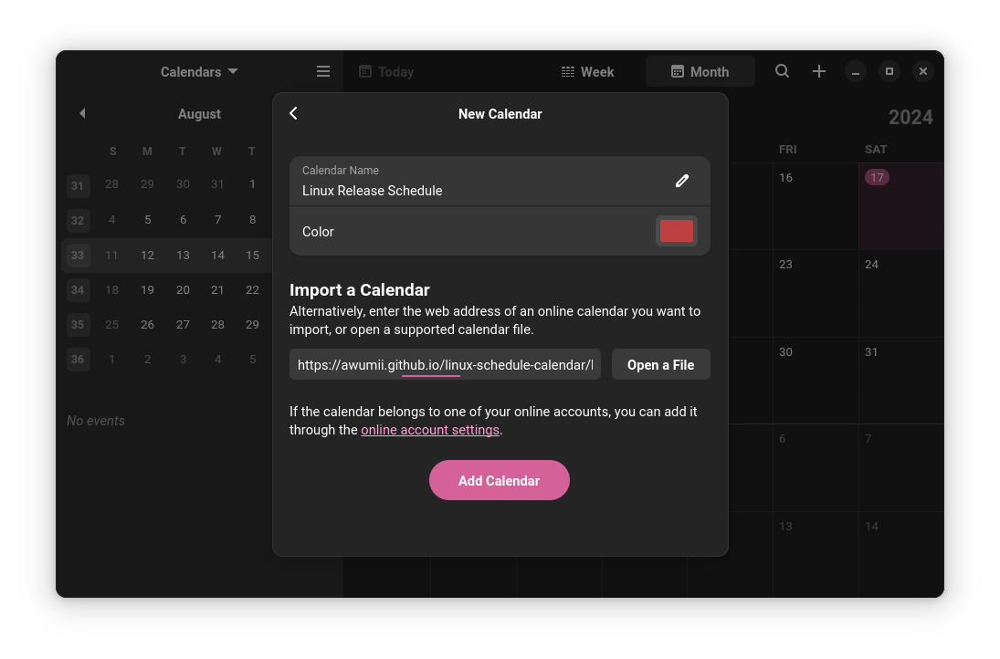
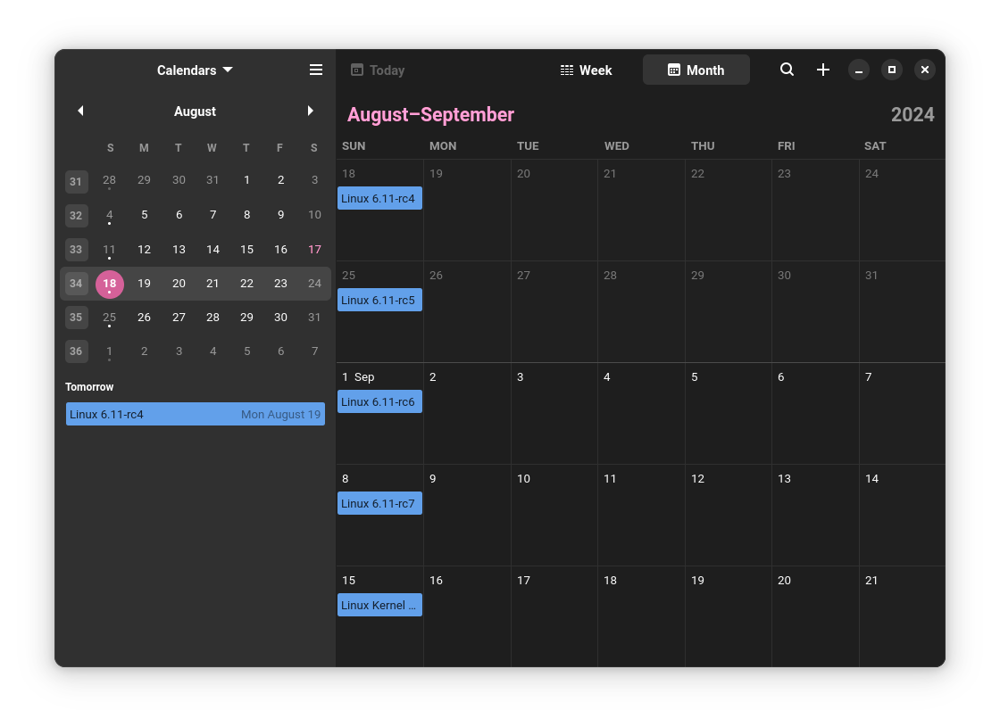

# Linux Schedule Calendar
Add the Linux kernel release schedule to your calendar.

This repository contains a Python script that generates an iCalendar file with release candidates for the current kernel release cycle.
It checks the current mainline version from kernel.org and predicts when the next releases will occur.

The calendar is updated automatically. You can import it using the webcal link below:  
[https://awumii.github.io/linux-schedule-calendar/linux-schedule.ics](https://awumii.github.io/linux-schedule-calendar/linux-schedule.ics)

Please do not use the .ics file directly. Use the import function of your calendar.
# Screenshots

